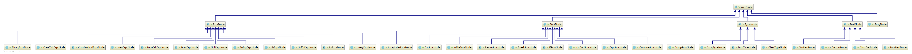

# Compiler of Language M*
A compiler from scratch for students of SJTU ACM 2016

- **中期报告**：到通过语义检查为止，该编译器项目一共经过以下几个阶段。

> 	1. 学习《自制编译器》- 青木峰郎
通过阅读书籍，了解从零实现编译器的大致流程：  
*词法分析*  ->  *语法分析*  ->  *建立抽象语法树*  ->  *语义分析*  -> ...

> 	2. 词法分析：
该阶段使用的词法分析工具为 **Antlr** 而非书中提及的 **JavaCC**，故将参考资料更换为 ***《The Definition of Antlr4》*** 以及其官方文档。

> 	3. 语法分析：
参考了官方文档中的 *C.g4* 文件，在其基础上进行修改以适配我们的 M\* 语言。新的 *g4* 文件保留了其各模块在源文件中的顺序以保证优先级的正确性，另外的修改为:
   - 删去了 *gcc* 相关以及一些不需要的特性
   - 增加了 *this*, *null*, *new* 标识符
   - 修正了 *BoolConstant* 的识别以及数组的表示方法  
   同时，我还将 *g4* 文件的语法结构用树的形式绘制了出来，更好的帮助自己理解该语言的词素结构，为之后的抽象语法树建立提供了便利。  
   

> 	4. 建立抽象语法树：
在此阶段，我使用了 **Antlr** 的 *Visitor* 的机制遍历 **CST**，结合上图节点思考设计了自己的 **ASTNodes**，继承关系如下图：  

同时我还为之前的 **CST** 树形图的每一个节点标注上其返回类型，为后续的语义分析提供便利。  

**AST** 的主要的特性为：  
- 借助 *VarDeclListNode* 这样的临时节点，向下批量接收变量定义，向上将内部存储的 *List<DeclNode\>* 分解，将所有的变量定义统一为单一的 *VarDeclNode*。
- 数组类型 *ArrayTypeNode* 为变量类型 *TypeNode* 的派生类，除了记录了当前数组元素类型，还利用基类记录了 *BaseType* 和 *Dim*，在进行多维数组语法检查时提供了便利。  

> 	5. 语义分析：
在编写完 *ASTBuilder* 之后，我首先进行了一些代码维护工作：  
- 将 **ASTNodes** 各类中的成员修正为 *private* 类型保证了程序的安全性。
- 为类增加了 *CST* 节点的指针，方便在 Debug 过程中回溯错误以及输出错误代码位置信息。
- 编写 *ASTViewer* 检验 **AST** 建立的正确性。  
而后使用 *SymbolTable* 的方式建立 *Scope* 进行语义分析及检查。  
其中对于类的成员，除了在类的作用域中添加定义，也在全局作用于 *ToplevelScope* 中增加形为 *"类名"."成员名"* 的定义。  
对于字符串与数组的内建函数，类名分别采用了 *#String* 以及 *#Array* 的方式。  
再次使用 *Visitor* 的方式遍历 **AST**，进行 **变量定义及使用** & **变量类型** & **左值** 检查最终通过 *Semantic Check。*
